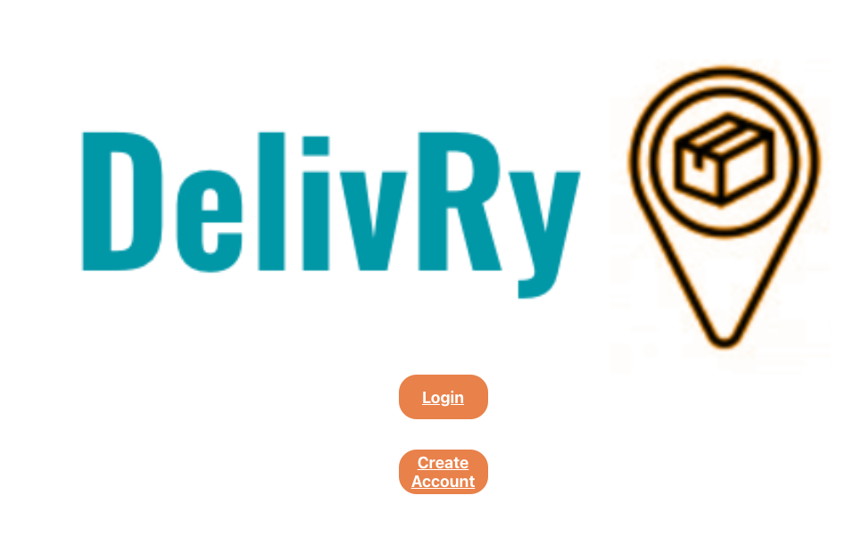
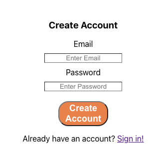
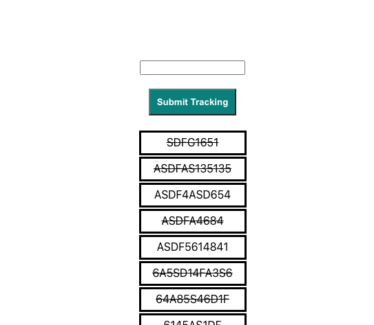

# DelivRy Package TRacking

## About

DelivRy is a supply chain management system designed to help users track their packages from XXXX in an easy to use application.

## User Story

As a small business owner I want one application to track packages for my business.

## Application Link

https://special-delivry.herokuapp.com/

## How to use DelivRy

After navigating to the link above, click the create account button

Next enter your email and password

After creating your account you will be taken to your package tracking dashboard.  Here you can enter the tracking number for the package you would like to track in the search bar at the top.  Packages you are currently tracking will be displayed in the list below the search bar.

## Contributors

Steven Crutchfield, 
Kenneth Ferguson, 
Rob Brunett

